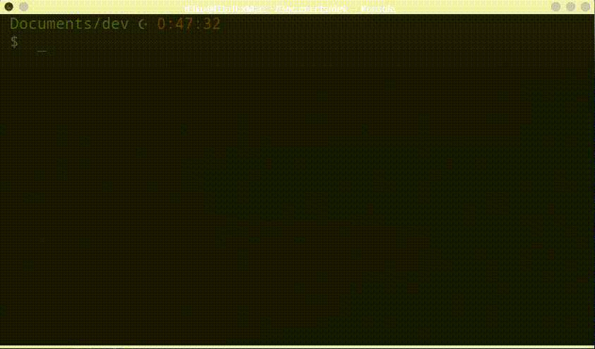

# zsh-themes
Fork of amuse theme of oh-my-zsh

## Install 
Copy the theme file, to **_~/.oh-my-zsh/themes/_**, and modify the tag **ZSH_THEME** in **_.zshrc_** file with **_halil_**.
### To use all the fonts, install Powerline in your system

## Halil Theme Preview:

